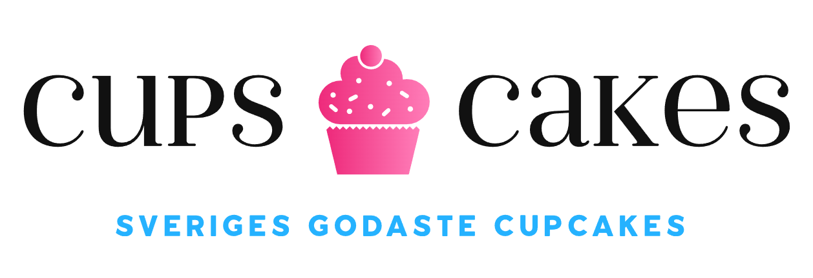
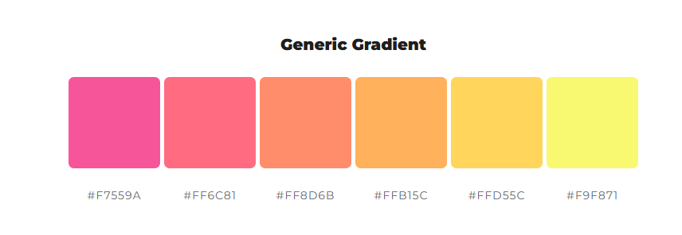

# Projektbeskrivning

[Trello](https://trello.com/invite/b/6942b5fbe9bf8dcfc350d37e/ATTI30956f6bf62f514077875786ac3ef73cAE907468/backlog) | [GitHub](https://github.com/Carowa27/eshop-group3)

### Cups and Cakes Bageri AB

Vi har Sveriges godaste cupcakes. 
Kom hit för att njuta av våra prisbelönta cupcakes! 
 
Vår päron cupcake har vunnit SM i godast cupcake.
 
Vi har även catering, hör av er vid intresse!

### Målgrupp

Trendiga storstadsmänniskor i åldersspannet 20-40 år som är aktiva på sociala medier.

## Grafisk profil

- Modernt
- Färgglatt
- Lekfullt

### Logotyp

### Färger

Två primära kulörer 
**f7559a** 

**25b2ff** 

Gradient som kompliment

### Fonter

Google Font, Domine 
https://fonts.google.com/selection?query=domine